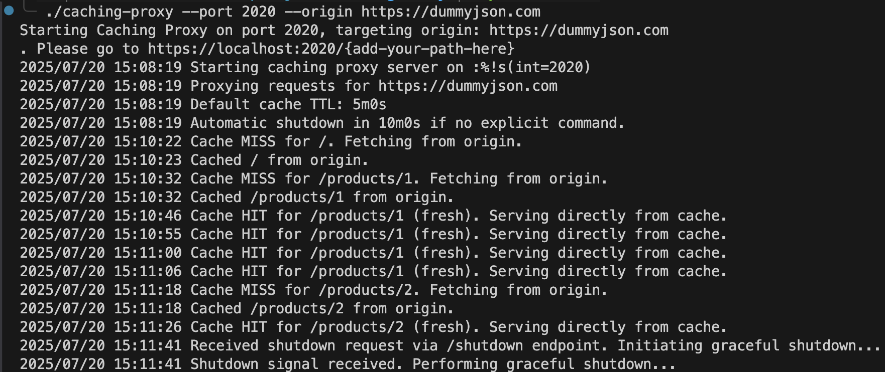

# Caching-Proxy

PROJECT LINK: https://roadmap.sh/projects/caching-server

## The Idea

build a CLI tool that starts a caching proxy server, it will forward requests to the actual server and cache the responses. If the same request is made again, it will return the cached response instead of forwarding the request to the server.

Requirements
User should be able to start the caching proxy server by running a command like following:

`caching-proxy --port <number> --origin <url>`
--port is the port on which the caching proxy server will run.
--origin is the URL of the server to which the requests will be forwarded.
For example, if the user runs the following command:

`caching-proxy --port 3000 --origin http://dummyjson.com`
The caching proxy server should start on port 3000 and forward requests to http://dummyjson.com

### Approach:

1. Find a CLI tool that achieves the User end functionality (handle the user inputs here + edge cases)
2. Design the backend server and caching logic to use
3. Sepeate the CLI logic from the server logic (can define seperate packages)
4. Write Test cases
5. Make sure to handle edge cases and graceful shutdowns
6. Integrate the backend with your desired CLI Tool

#### Steps to test:

1. Run `go build` to create the binary
2. Run `./caching-proxy --port 2020 --origin https://dummyjson.com` (an example command)
3. Open another terminal, and Run `curl - s http://localhost:2020/products/1 | jq` to get a pretty Response
4. NOTE: _https://localhost:x/_ won't work, (handshake cannot be established)
5. The server closes automatically after 10 minutes, providing graceful shutdown
6. To check headers, Run `curl -i http://localhost:2020/products/1`
7. Run `curl -s http://localhost:2020/shutdown` for manually closing the server

### Featues:

### Future Roadmap:
